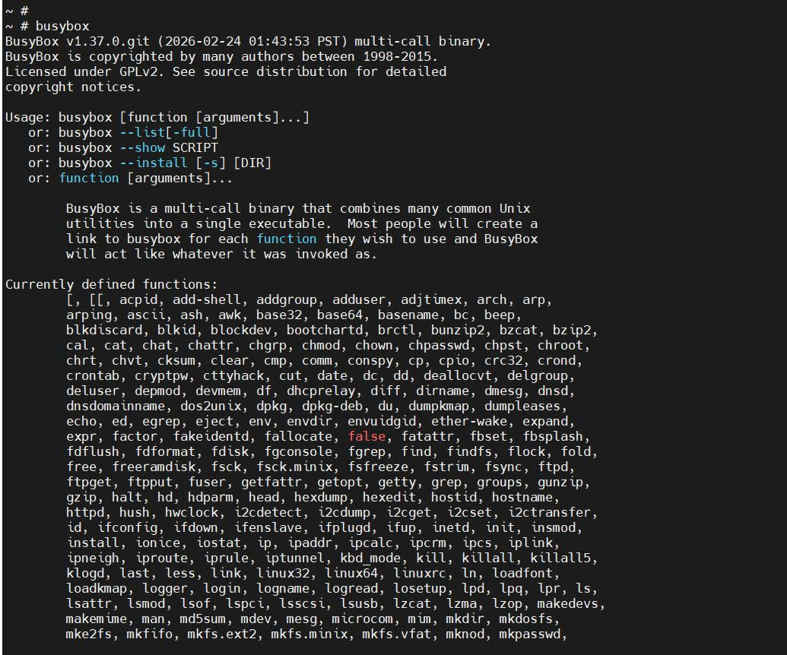
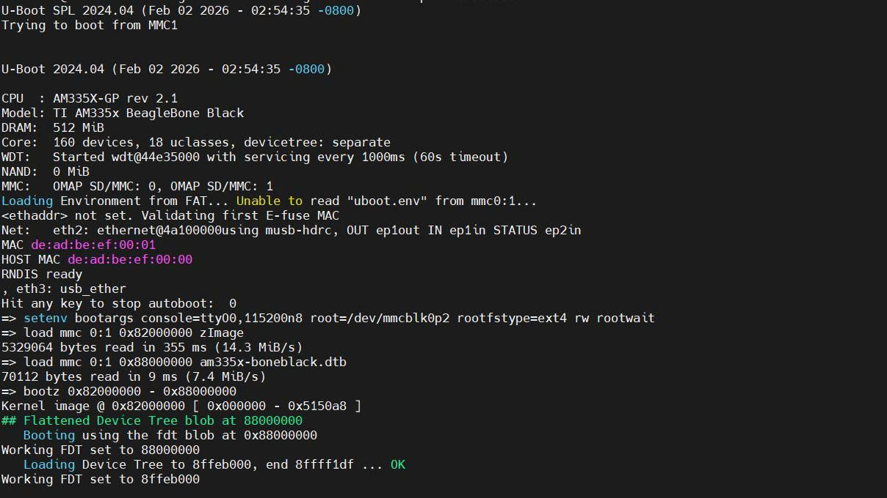
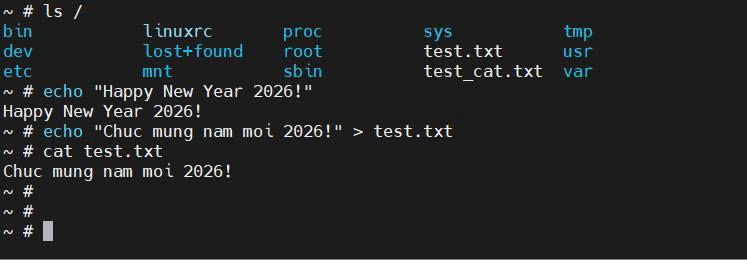
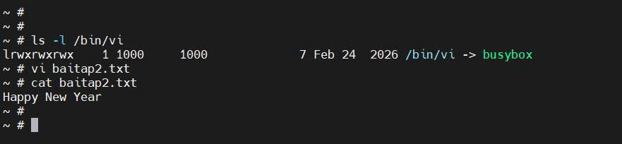

<<<<<<< HEAD
# Root File System (RootFS)
##  Mục tiêu

* **Bài tập 1 (Cài đặt RootFS cơ bản):** Biên dịch Root File System (RootFS) từ mã nguồn BusyBox.
  * Định dạng và cấu trúc thẻ nhớ (phân vùng BOOT FAT32 và ROOTFS ext4).
  * Liên kết Kernel với RootFS thông qua  `bootargs` và khởi động thành công trên board.
  * Xác nhận hệ điều hành hoạt động tốt qua các lệnh cơ bản: `ls`, `echo`, `cat`.

* **Bài tập 2 (Tùy chỉnh RootFS):** Cấu hình `menuconfig` của BusyBox để tích hợp trình soạn thảo văn bản `vi`.
  * Xác nhận sự tồn tại của gói `vi` trên board.
  * Thử nghiệm, chỉnh sửa và lưu thành công một file văn bản.

---

## Quá trình thực hiện

### PHẦN 1: BIÊN DỊCH VÀ XÂY DỰNG ROOTFS

#### 1. Tải mã nguồn BusyBox
```
cd ~/workspace
git clone https://github.com/mirror/busybox.git
cd busybox
```
#### 2. Thiết lập môi trường biên dịch
```
export PATH=$HOME/x-tools/arm-cortex_a8-linux-gnueabi/bin:$PATH
export CROSS_COMPILE=arm-cortex_a8-linux-gnueabi-
export ARCH=arm
```
#### 3. Cấu hình BusyBox (Tích hợp vi cho Bài 2)
Tạo cấu hình mặc định và mở giao diện tùy chỉnh để chọn trình soạn thảo vi .
```
make defconfig
make menuconfig
```
(Trong giao diện menuconfig: Tìm mục Editors ---> -> Nhấn Enter -> Nhấn space để bật mục vi -> Chọn Exit và Save để lưu cấu hình).

#### 4. Biên dịch và Cài đặt
Dọn dẹp các file rác cũ để biên dịch, và cài đặt vào thư mục ../rootfs.
```
make clean
make -j$(nproc)
make install CONFIG_PREFIX=../rootfs
```
#### 5. Hoàn thành cấu trúc RootFS
Vào thư mục rootfs và tạo thêm các thư mục cần yếu của Linux. Lệnh `busybox` dùng để kiểm tra file nhị phân vừa tạo.
```
cd ../rootfs
mkdir -p dev etc proc sys tmp var root mnt
busybox
```
### Kết quả đạt được:

---

### PHẦN 2: CHUẨN BỊ THẺ NHỚ VÀ NẠP DỮ LIỆU
#### 1. Định dạng thẻ nhớ
Gỡ kết nối thẻ nhớ. Format phân vùng 1 thành FAT32 (chứa Kernel/Bootloader). Format phân vùng 2 thành ext4 (chứa RootFS) kèm theo các tùy chọn tắt tính năng gây lỗi trên hệ nhúng.
```
sudo umount -l /dev/sdb*
sudo mkfs.vfat -F 32 -n BOOT /dev/sdb1
sudo mkfs.ext4 -F -L ROOTFS -O ^metadata_csum,^64bit -E nodiscard /dev/sdb2
```
#### 2. Nạp file vào phân vùng BOOT
```
sudo mkdir -p /mnt/boot
sudo mount /dev/sdb1 /mnt/boot
sync
sudo umount /mnt/boot
```

#### 3. Nạp RootFS vào phân vùng ROOTFS
Tham số -a để chép toàn bộ cây thư mục BusyBox vừa tạo sang phân vùng ext4 của thẻ nhớ, bảo toàn file.
```
sudo mkdir -p /mnt/rootfs
sudo mount /dev/sdb2 /mnt/rootfs
sudo cp -a ~/workspace/rootfs/. /mnt/rootfs/
sync
sudo umount /mnt/rootfs
```
### PHẦN 3: KHỞI ĐỘNG VÀ THỬ NGHIỆM
#### 1. Khởi động hệ thống
Thiết lập tham số root=/dev/mmcblk0p2 để trỏ đúng vào phân vùng thẻ nhớ.
```
setenv bootargs console=ttyO0,115200n8 root=/dev/mmcblk0p2 rootfstype=ext4 rw rootwait
load mmc 0:1 0x82000000 zImage
load mmc 0:1 0x88000000 am335x-boneblack.dtb
bootz 0x82000000 - 0x88000000
```
#### Kết quả đạt được:

---
#### 2. Thử nghiệm bài 1
Tại dấu ~ #, gõ các lệnh sau để thử nghiệm
```
ls /
echo "Happy New Year 2026!"
cat test.txt
```
#### Kết quả đạt được: 

---
#### 3. Thử nghiệm bài 2
Kiểm tra sự tồn tại và cấu trúc của gói vi, thực hiện mở file, soạn thảo và đọc file để chứng minh quá trình hoạt động.
```
ls -l /bin/vi
vi bai_tap_2.txt
cat bai_tap_2.txt
```
#### Kết quả đạt được:



=======
# Root File System (RootFS)
##  Mục tiêu đạt được

* **Bài 1 (Cài đặt RootFS cơ bản):** Biên dịch Root File System (RootFS) từ mã nguồn BusyBox.
  * Định dạng và cấu trúc thẻ nhớ (phân vùng BOOT FAT32 và ROOTFS ext4).
  * Liên kết Kernel với RootFS thông qua  `bootargs` và khởi động thành công trên board.
  * Xác nhận hệ điều hành hoạt động tốt qua các lệnh cơ bản: `ls`, `echo`, `cat`.

* **Bài tập 2 (Tùy chỉnh RootFS):** Cấu hình `menuconfig` của BusyBox để tích hợp trình soạn thảo văn bản `vi`.
  * Xác nhận sự tồn tại của gói `vi` trên board.
  * Thử nghiệm, chỉnh sửa và lưu thành công một file văn bản.

---

## Quá trình thực hiện

### PHẦN 1: BIÊN DỊCH VÀ XÂY DỰNG ROOTFS

#### 1. Tải mã nguồn BusyBox
```
cd ~/workspace
git clone https://github.com/mirror/busybox.git
cd busybox
```
#### 2. Thiết lập môi trường biên dịch
```
export PATH=$HOME/x-tools/arm-cortex_a8-linux-gnueabi/bin:$PATH
export CROSS_COMPILE=arm-cortex_a8-linux-gnueabi-
export ARCH=arm
```
#### 3. Cấu hình BusyBox (Tích hợp vi cho Bài 2)
Tạo cấu hình mặc định và mở giao diện tùy chỉnh để chọn trình soạn thảo vi .
```
make defconfig
make menuconfig
```
(Trong giao diện menuconfig: Tìm mục Editors ---> -> Nhấn Enter -> Nhấn space để bật mục vi -> Chọn Exit và Save để lưu cấu hình).

#### 4. Biên dịch và Cài đặt
Dọn dẹp các file rác cũ để biên dịch, và cài đặt vào thư mục ../rootfs.
```
make clean
make -j$(nproc)
make install CONFIG_PREFIX=../rootfs
```
#### 5. Hoàn thành cấu trúc RootFS
Vào thư mục rootfs và tạo thêm các thư mục cần yếu của Linux. Lệnh `busybox` dùng để kiểm tra file nhị phân vừa tạo.
```
cd ../rootfs
mkdir -p dev etc proc sys tmp var root mnt
busybox
```
### Kết quả đạt được:

---

### PHẦN 2: CHUẨN BỊ THẺ NHỚ VÀ NẠP DỮ LIỆU
#### 1. Định dạng thẻ nhớ
Gỡ kết nối thẻ nhớ. Format phân vùng 1 thành FAT32 (chứa Kernel/Bootloader). Format phân vùng 2 thành ext4 (chứa RootFS) kèm theo các tùy chọn tắt tính năng gây lỗi trên hệ nhúng.
```
sudo umount -l /dev/sdb*
sudo mkfs.vfat -F 32 -n BOOT /dev/sdb1
sudo mkfs.ext4 -F -L ROOTFS -O ^metadata_csum,^64bit -E nodiscard /dev/sdb2
```
#### 2. Nạp file vào phân vùng BOOT
```
sudo mkdir -p /mnt/boot
sudo mount /dev/sdb1 /mnt/boot
sync
sudo umount /mnt/boot
```

#### 3. Nạp RootFS vào phân vùng ROOTFS
Tham số -a để chép toàn bộ cây thư mục BusyBox vừa tạo sang phân vùng ext4 của thẻ nhớ, bảo toàn file.
```
sudo mkdir -p /mnt/rootfs
sudo mount /dev/sdb2 /mnt/rootfs
sudo cp -a ~/workspace/rootfs/. /mnt/rootfs/
sync
sudo umount /mnt/rootfs
```
### PHẦN 3: KHỞI ĐỘNG VÀ THỬ NGHIỆM
#### 1. Khởi động hệ thống
Thiết lập tham số root=/dev/mmcblk0p2 để trỏ đúng vào phân vùng thẻ nhớ.
```
setenv bootargs console=ttyO0,115200n8 root=/dev/mmcblk0p2 rootfstype=ext4 rw rootwait
load mmc 0:1 0x82000000 zImage
load mmc 0:1 0x88000000 am335x-boneblack.dtb
bootz 0x82000000 - 0x88000000
```
### Kết quả đạt được:

---
#### 2. Thử nghiệm bài 1
Tại dấu ~ #, gõ các lệnh sau để thử nghiệm
```
ls /
echo "Happy New Year!" > test.txt
cat test.txt
```
### Kết quả đạt được: 

---
#### 3. Thử nghiệm bài 2
Kiểm tra sự tồn tại và cấu trúc của gói vi, thực hiện mở file, soạn thảo và đọc file để chứng minh quá trình hoạt động.
```
ls -l /bin/vi
vi bai_tap_2.txt
cat bai_tap_2.txt
```
### Kết quả đạt được:

>>>>>>> f04ba87 (update)
