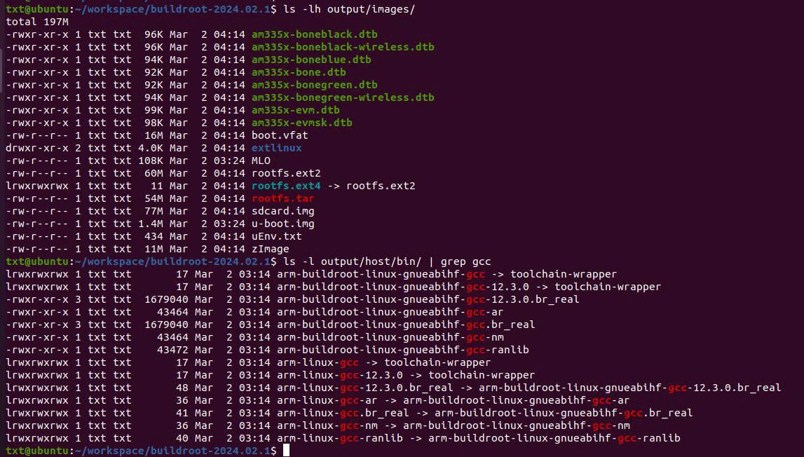
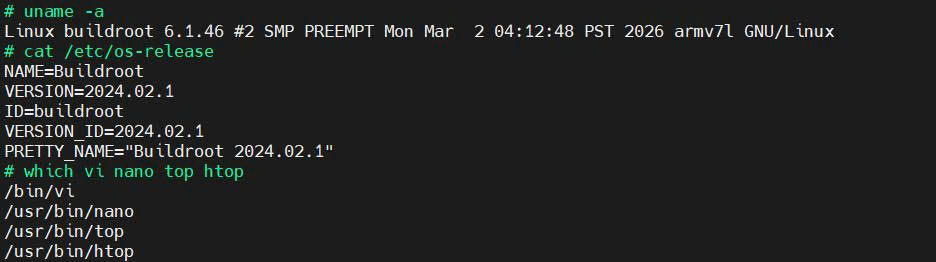
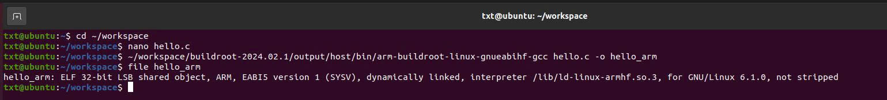
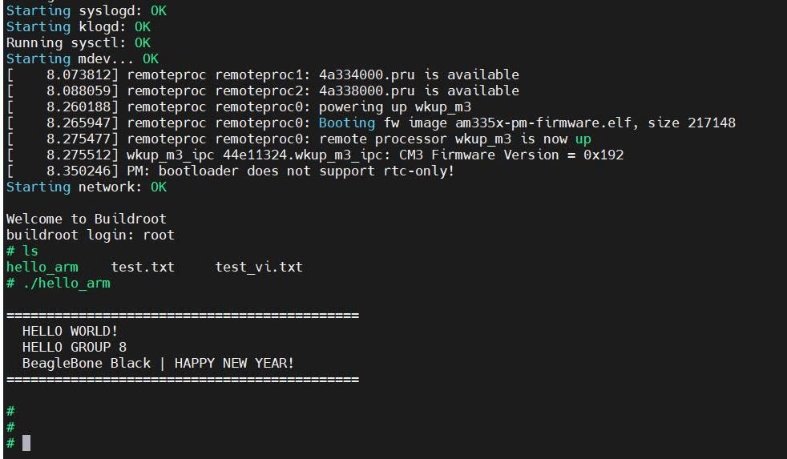
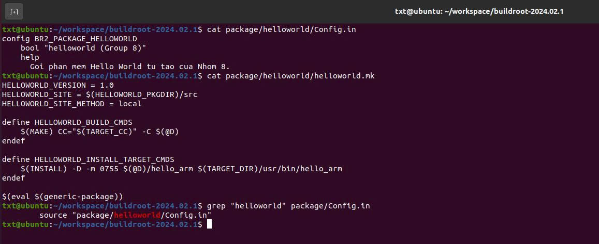
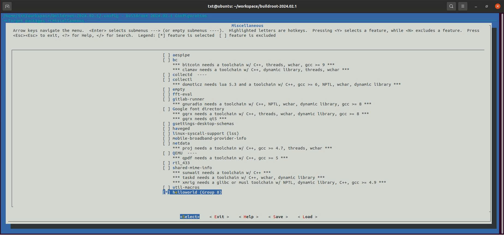
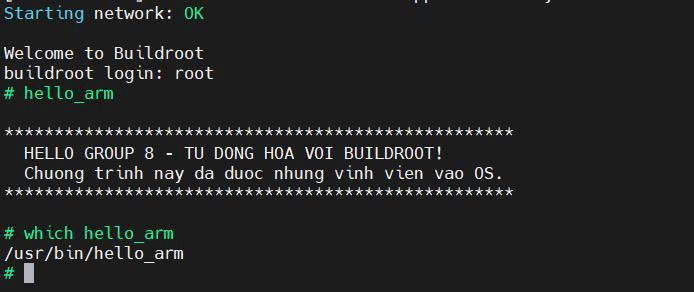

# System Build
# Bài tập 1: Biên dịch Buildroot cho BeagleBone Black

## Mô tả mục tiêu
Mục tiêu là biên dịch toàn bộ hệ điều hành tùy chỉnh từ mã nguồn Buildroot. Biết cách thêm hoặc bớt các gói phần mềm (packages) để tối ưu hóa RootFS. Kết quả cuối cùng là một bản Image hoàn chỉnh và Toolchain để phát triển ứng dụng sau này.

## Quá trình thực hiện
* **Bước 1: Tải và giải nén mã nguồn Buildroot:**
    ```bash
    cd ~/workspace
    wget https://buildroot.org/downloads/buildroot-2024.02.1.tar.gz
    tar -zxvf buildroot-2024.02.1.tar.gz
    cd buildroot-2024.02.1
    ```
* **Bước 2: Cấu hình mặc định cho BBB:**
    ```bash
    make beaglebone_defconfig
    ```
* **Bước 3: Tùy chỉnh thêm/bỏ phần mềm (Menuconfig):**
    Sử dụng lệnh `make menuconfig` để mở giao diện đồ họa. Trong giao diện này, dùng phím **Space** để đánh dấu chọn `[*]`:
    * **Thêm trình soạn thảo (Nano & Vim):** Chuyển đến `Target packages` -> `Text editors and viewers`, sau đó chọn `[*] nano` và `[*] vim`.
    * **Thêm công cụ giám sát (Htop):** Chuyển đến `Target packages` -> `System tools`, sau đó chọn `[*] htop`.
    * Lưu lại (Save) cấu hình và Exit.
* **Bước 4: Tiến hành biên dịch hệ thống:**
    ```bash
    make
    ```
    Quá trình này sẽ sinh ra file `sdcard.img` và bộ Toolchain tại thư mục `output/host/bin/`.
    ### Kết quả đạt được:
    
    ---
* **Bước 5: Nạp Image vào thẻ nhớ:**
    ```bash
    sudo dd if=output/images/sdcard.img of=/dev/sdb bs=4M status=progress
    ```
* **Bước 6: Khởi chạy trên BeagleBone Black:**
    * Cắm thẻ nhớ đã nạp vào board BBB.
    * Cấp nguồn và ép boot từ thẻ.
    * Khi màn hình Console yêu cầu `buildroot login:`, nhập `root` (không cần password) để đăng nhập thành công.
    ### Kết quả đạt được:
    
    ---

# Bài tập 2: Dùng Toolchain từ Buildroot để biên dịch C/C++

## Mô tả mục tiêu
Mục tiêu là hiểu được quy trình **Biên dịch chéo (Cross-compiling)**. Sử dụng chính bộ Toolchain mà Buildroot vừa tạo ra để biên dịch một chương trình "Hello World" trên máy ảo Ubuntu, sau đó sao chép thủ công file thực thi xuống BeagleBone Black để khởi chạy.

## Quá trình thực hiện
* **Bước 1: Viết chương trình C :**
    ```bash
    cd ~/workspace
    nano hello.c 
    ```
    *(Tạo file `hello.c` và viết chương trình cơ bản).*
* **Bước 2: Biên dịch chéo bằng Toolchain của Buildroot:**
    ```bash
    ~/workspace/buildroot-2024.02.1/output/host/bin/arm-buildroot-linux-gnueabihf-gcc hello.c -o hello_arm
    ```
    ### Kết quả biên dịch:
    
    ---
* **Bước 3: Sao chép thủ công chương trình vào RootFS:**
    Cắm thẻ nhớ chứa RootFS vào và chép file thực thi sang.
    ```bash
    sudo cp hello_arm /mnt/root/
    ```
* **Bước 4: Thử nghiệm trên BeagleBone Black:**
    Rút thẻ nhớ ra và cắm vào BBB để khởi động. Tại màn hình Console, chạy lệnh `./hello_arm` để hiển thị kết quả.
    ### Kết quả đạt được:
    
    ---

# Bài tập 03 (Tùy chọn): Thêm Package vào Buildroot

## Mô tả mục tiêu
Mục tiêu là tự động hóa quy trình đưa phần mềm vào hệ điều hành. Thay vì sao chép thủ công như Bài 2, mà chuyển chương trình "Hello World" thành một **Package** của Buildroot. Khi biên dịch lại, Buildroot sẽ tự động tạo lệnh hệ thống từ mã nguồn này, giúp phần mềm tồn tại vĩnh viễn trong Image và có thể gọi ra từ bất kỳ đâu.

## Quá trình thực hiện
* **Bước 1: Khởi tạo cấu trúc thư mục cho Package mới:**
    ```bash
    mkdir -p package/helloworld/src
    ```
* **Bước 2: Chuẩn bị mã nguồn và Makefile nội bộ:**
    ```bash
    # Tạo mã nguồn C
    cat << 'EOF' > package/helloworld/src/hello.c
    #include <stdio.h>
    int main() {
    ...
    }
    EOF

    # Tạo Makefile cho mã nguồn
    printf 'all:\n\t$(CC) hello.c -o hello_arm\n' > package/helloworld/src/Makefile
    ```
* **Bước 3: Tạo các tệp cấu hình (Config.in & .mk) cho Buildroot:**
    ```bash
    # Tạo tệp giao diện Menuconfig
    cat << 'EOF' > package/helloworld/Config.in
    config BR2_PACKAGE_HELLOWORLD
        bool "helloworld (Group 8)"
        help
          Goi phan mem Hello World.
    EOF

    # Tạo file helloworld.mk
    cat << 'EOF' > package/helloworld/helloworld.mk
    HELLOWORLD_VERSION = 1.0
    HELLOWORLD_SITE = $(HELLOWORLD_PKGDIR)/src
    HELLOWORLD_SITE_METHOD = local

    define HELLOWORLD_BUILD_CMDS
        $(MAKE) CC="$(TARGET_CC)" -C $(@D)
    endef

    define HELLOWORLD_INSTALL_TARGET_CMDS
        $(INSTALL) -D -m 0755 $(@D)/hello_arm $(TARGET_DIR)/usr/bin/hello_arm
    endef

    $(eval $(generic-package))
    EOF
    ```
* **Bước 4: Đăng ký Package vào menu tổng của Buildroot:**
    * Mở file: `nano package/Config.in`
    * Tìm mục `Miscellaneous`.
    * Thêm dòng tham chiếu sau vào dưới tên menu:
        ```text
        source "package/helloworld/Config.in"
        ```
    
    
    ---
* **Bước 5: Bật Package và Biên dịch lại:**
    * Sử dụng lệnh `make menuconfig`.
    * Tìm đến mục `Miscellaneous` và bật gói `[*] helloworld (Group 8)`.

    
    ---
    * Lưu cấu hình và chạy lệnh `make` để Buildroot tự động cập nhật lại Image.
* **Bước 6: Thử nghiệm chức năng:**
    Nạp lại thẻ nhớ và boot trên BBB. Tại giao diện dòng lệnh, chỉ cần gõ tên gói như một lệnh hệ thống bình thường (không cần dấu `./`) để chạy thử.
    ### Kết quả đạt được:
    
    ---

