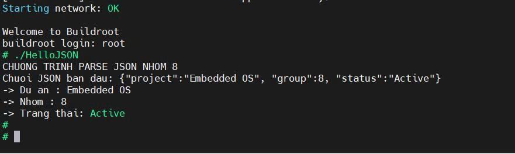
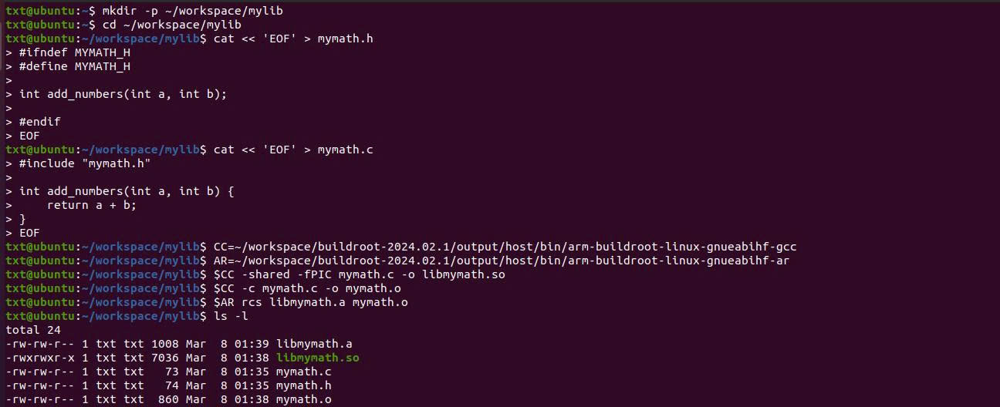
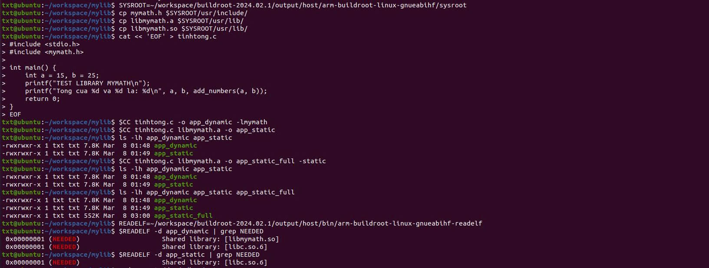
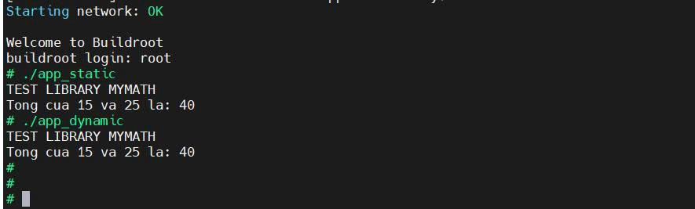
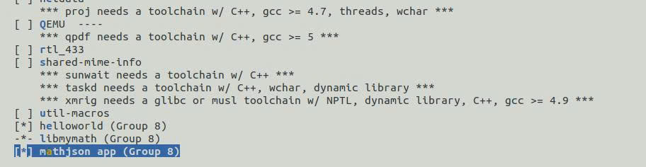
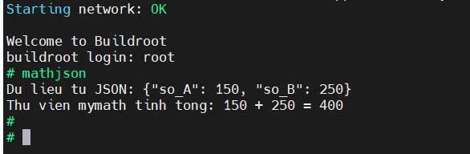

# Tuần 5: Biên dịch chéo thư viện và ứng dụng 
## Bài tập 01: Biên dịch ứng dụng với thư viện cJSON
### 1. Mục tiêu
Sử dụng thư viện `cJSON` để phân tích một gói tin JSON. Sử dụng Toolchain để biên dịch chéo với cờ liên kết thư viện (`-lcjson`), và thử nghiệm ứng dụng trên board BeagleBone Black.
### 2. Quá trình thực hiện 
* **Bước 1: Bật thư viện cJSON và Build lại OS**

  Di chuyển vào thư mục Buildroot và mở giao diện cấu hình:
  ```
  cd ~/workspace/buildroot-2024.02.1
  make menuconfig
  ```
  Chọn Target packages -> Libraries -> JSON/XML -> Nhấn Space để chọn cJSON [*]. Sau đó lưu lại và tiến hành biên dịch lại hệ thống.

* **Bước 2: Viết mã nguồn C xử lý JSON**

    Mục đích là để khởi tạo một chuỗi JSON mô phỏng chứa các thông tin (ví dụ: tên dự án, nhóm và trạng thái). Sử dụng hàm `cJSON_Parse()` để đọc toàn bộ chuỗi và `cJSON_GetObjectItem()` để bóc tách, in các thông tin dữ liệu ra màn hình. Cuối cùng `cJSON_Delete()` để giải phóng bộ nhớ.

* **Bước 3: Biên dịch chéo**

    Sử dụng Toolchain của Buildroot để biên dịch. Bắt buộc phải thêm cờ -lcjson để trình biên dịch biết cách liên kết hàm với thư viện cJSON đã được tạo ra ở Bước 1
    ```
    ~/workspace/buildroot-2024.02.1/output/host/bin/arm-buildroot-linux-gnueabihf-gcc HelloJSON.c -o HelloJSON -lcjson
    ```
* **Bước 4: Nạp hệ điều hành và Đưa ứng dụng xuống RootFS**

    Nạp lại file .img chứa OS mới (tích hợp cJSON) xuống thẻ nhớ:
    ```
    sudo dd if=~/workspace/buildroot-2024.02.1/output/images/sdcard.img of=/dev/sdb bs=4M status=progress
    ```
    Sau đó, gắn phân vùng RootFS để copy file thực thi:
    ```
    sudo cp ~/workspace/HelloJSON /mnt/root/
    ```
* **Bước 5: Khởi chạy trên BBB**
    Cắm thẻ nhớ vào board và khởi chạy ứng dụng bằng lệnh `./HelloJSON`
  ### Kết quả thu được:
  
---
## Bài tập 02: Tự tạo thư viện cá nhân
### 1. Mục tiêu
Tạo một thư viện toán cơ bản (libmymath). Hiểu rõ quy trình biên dịch thư viện ra hai định dạng: Thư viện tĩnh (.a) và Thư viện động (.so). Thực hành đưa thư viện vào Sysroot, biên dịch ứng dụng sử dụng chúng, và phân tích sự khác biệt về dung lượng và sự phụ thuộc.

### 2. Quá trình thực hiện 
* **Bước 1: Viết mã nguồn thư viện**

    Tạo thư mục `~/workspace/mylib`. Khởi tạo 2 file `mymath.h` (khai báo hàm) và `mymath.c` (định nghĩa hàm add_numbers).

* **Bước 2: Biên dịch ra Thư viện Động và Tĩnh**

    Sử dụng công cụ GCC và AR của Buildroot:
    ```
    CC=~/workspace/buildroot-2024.02.1/output/host/bin/arm-buildroot-linux-gnueabihf-gcc
    AR=~/workspace/buildroot-2024.02.1/output/host/bin/arm-buildroot-linux-gnueabihf-ar

    # Tạo Thư viện động (.so) với cờ Position Independent Code
    $CC -shared -fPIC mymath.c -o libmymath.so

    # Tạo Thư viện tĩnh (.a) bằng cách đóng gói file Object
    $CC -c mymath.c -o mymath.o
    $AR rcs libmymath.a mymath.o
    ```
    #### Kết quả biên dịch:
    
* **Bước 3: Cập nhật thư viện vào Sysroot**

    Để Toolchain tự động tìm thấy thư viện khi biên dịch các app khác, nên phải sao chép file Header và file Lib vào Sysroot:

    ```
    SYSROOT=~/workspace/buildroot-2024.02.1/output/host/arm-buildroot-linux-gnueabihf/sysroot
    cp mymath.h $SYSROOT/usr/include/
    cp libmymath.a $SYSROOT/usr/lib/
    cp libmymath.so $SYSROOT/usr/lib/
    ```
* **Bước 4: Viết ứng dụng và Biên dịch thành 2 phiên bản**

    Viết file tinhtong.c có gọi hàm add_numbers() từ mymath.h. Sau đó tiến hành biên dịch:
    ```
    # App dùng thư viện động
    $CC tinhtong.c -o app_dynamic -lmymath

    # App ép tĩnh hoàn toàn (kể cả với thư viện hệ thống C)
    $CC tinhtong.c libmymath.a -o app_static_full -static
    ```
    #### Kết quả biên dịch:
    
* **Bước 5: So sánh và Phân tích**

    Kiểm tra dung lượng: `ls -lh app_dynamic app_static_full`. (Kết quả: app_static_full có dung lượng lớn gấp nhiều lần do đã ép toàn bộ thư viện tĩnh vào trong).

    Kiểm tra sự phụ thuộc: app_dynamic sẽ yêu cầu thư viện libmymath.so lúc chạy, còn app_static không yêu cầu
    ```
    READELF=~/workspace/buildroot-2024.02.1/output/host/bin/arm-buildroot-linux-gnueabihf-readelf
    $READELF -d app_dynamic | grep NEEDED
    $READELF -d app_static | grep NEEDED
    ```
* **Bước 6: Thử nghiệm trên BBB**
    Sao chép 2 ứng dụng vào /root/. Và phải sap chép kèm file libmymath.so vào /usr/lib/ của thẻ nhớ thì app_dynamic mới có thể hoạt động.
    ### Kết quả thu được:
    
---
## Bài tập 03: Tích hợp ứng dụng, thư viện vào Buildroot
### 1. Mục tiêu
Chuyển đổi thủ công thành hệ thống tự động hoàn toàn. Đưa libmymath và ứng dụng mathjson thành các Package  của Buildroot. Thiết lập Ràng buộc phụ thuộc: Bật ứng dụng mathjson sẽ tự động kéo theo việc kích hoạt và biên dịch cJSON và libmymath.

### 2. Quá trình thực hiện
* **Bước 1: Tạo Package Thư viện (libmymath)**

    Tạo thư mục `package/libmymath/src` chứa mã nguồn thư viện. Viết file giao diện `Config.in`. Thiết lập file kịch bản `libmymath.mk` với câu lệnh quan trọng:
    ```
    LIBMYMATH_INSTALL_STAGING = YES
    ```
    (Mục đích để chỉ thị cho Buildroot tự động copy các file .h và .so của thư viện này vào Sysroot ngay sau khi biên dịch xong).

* **Bước 2: Tạo Package Ứng dụng tích hợp (mathjson)**

    Tạo thư mục `package/mathjson/src` chứa mã nguồn `mathjson.c` (gọi hàm bóc tách của cJSON và hàm tính tổng của libmymath).
  
    Thiết lập Ràng buộc phụ thuộc: trong file `Config.in` của mathjson, khai báo bắt buộc chọn 2 gói thư viện:
    ```
    select BR2_PACKAGE_CJSON
    select BR2_PACKAGE_LIBMYMATH
    ```
    Trong file `mathjson.mk`, quy định thứ tự biên dịch (thư viện phải build xong trước app):
    ```
    MATHJSON_DEPENDENCIES = cjson libmymath
    ```
* **Bước 3: Đăng ký Package và Thử nghiệm sự phụ thuộc**
    * Mở `package/Config.in` và thêm 2 đường dẫn source của hai package mới vào mục `Miscellaneous`.
    * Khởi chạy `make menuconfig`. Vào mục `Miscellaneous`, khi nhấn Space để chọn [ ] mathjson app (Group 8), hệ thống tự động bật cả 2 package libmymath và cJSON.
    #### Kết quả:
    
* **Bước 4: Build và Thử nghiệm**
    * Gõ lệnh `make` để Buildroot tiến hành biên dịch toàn bộ hệ thống theo thứ tự dependency.
    * Nạp sdcard.img vào thẻ nhớ. Khởi động BBB và chạy lệnh mathjson để xem kết quả.
    ### Kết quả đạt được:
    
---


