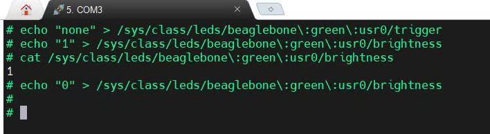
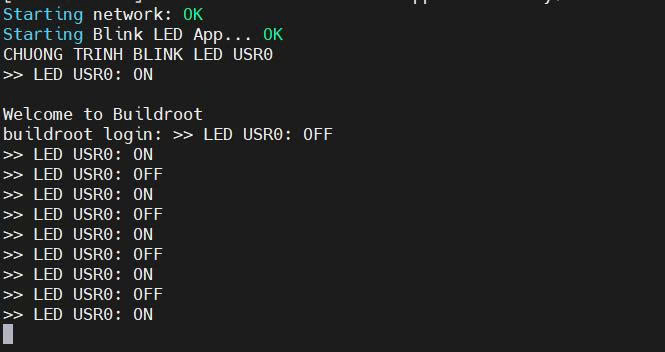

# Bài tập HDH Nhúng - Ứng dụng tổng hợp

## I. Mục tiêu bài tập
Trong hệ điều hành Linux, mọi thiết bị phần cứng đều được trừu tượng hóa dưới dạng các tệp tin (File). Bài tập này có mục đích là thao tác với các tệp tin ảo này thông qua hệ thống `sysfs` để điều khiển ngoại vi.
* **Mục tiêu 1:** Tương tác trực tiếp với Device Driver của BeagleBone Black (BBB) quản lý LED bằng các lệnh cơ bản (`cat`, `echo`).
* **Mục tiêu 2:** Viết chương trình C/C++ giao tiếp với Driver để tự động  nhấp nháy LED.
* **Mục tiêu 3:** Đóng gói chương trình thành một Package vào Buildroot và cấu hình quá trình khởi chạy ngầm ngay khi hệ điều hành boot thành công.
---
## II. Quá trình thực hiện
### Phần 1: Giao tiếp trực tiếp với Device Driver 
Hệ điều hành quản lý 4 đèn LED tích hợp của BBB tại đường dẫn ảo `/sys/class/leds/`.

**1. Tắt chế độ nhấp nháy mặc định của hệ thống:**

Sử dụng lệnh `echo none` để ngắt trigger và giành quyền điều khiển LED USR0:
```
echo none > /sys/class/leds/beaglebone\:green\:usr0/trigger
```
**2. Bật LED (ON) và kiểm tra trạng thái:**
```
echo 1 > /sys/class/leds/beaglebone\:green\:usr0/brightness
cat /sys/class/leds/beaglebone\:green\:usr0/brightness
```

**3. Tắt LED (OFF):**
```
echo 0 > /sys/class/leds/beaglebone\:green\:usr0/brightness
```
#### 
---
### Phần 2: Viết chương trình C/C++ giao tiếp và tự động khởi chạy với Buildroot 

Viết chương trình C để hệ thống tự động hóa thao tác ghi tệp tin ảo, sau đó biên dịch chương trình.

**1. Khởi tạo Package**

Tạo không gian làm việc
```
cd ~/workspace/buildroot-2024.02.1/
mkdir -p package/blink/src
```
Viết chương trình blink.c.
```
cat << 'EOF' > package/blink/src/blink.c
#include <stdio.h>
#include <unistd.h>

#define TRIGGER "/sys/class/leds/beaglebone:green:usr0/trigger"
#define BRIGHTNESS "/sys/class/leds/beaglebone:green:usr0/brightness"

void write_file(const char *path, const char *value) {
    FILE *f = fopen(path, "w");
    if (f != NULL) {
        fprintf(f, "%s", value);
        fclose(f);
    }
}

int main() {
    printf("CHUONG TRINH BLINK LED USR0 \n");
    fflush(stdout); // Ep xả bộ đệm để in ra màn hình lập tức 

    write_file(TRIGGER, "none");
    
    while(1) {
        write_file(BRIGHTNESS, "1");
        printf(">> LED USR0: ON\n");
        fflush(stdout);
        sleep(1);
        
        write_file(BRIGHTNESS, "0");
        printf(">> LED USR0: OFF\n");
        fflush(stdout);
        sleep(1);
    }   
    return 0;
}
EOF
```
**2. Cấu Hình Script Tự Khởi chạy**

* Tạo file S99blink (thứ tự ưu tiên thấp nhất, đảm bảo ứng dụng chỉ chạy khi toàn bộ Kernel và OS đã load xong).

* Ký tự & sau lệnh gọi app giúp chương trình chạy dưới nền hệ thống.
```
cat << 'EOF' > package/blink/S99blink
#!/bin/sh
case "$1" in
  start)
    printf "Starting Blink LED App... "
    /usr/bin/blink &
    echo "OK"
    ;;
  stop)
    printf "Stopping Blink LED App... "
    killall blink
    echo "OK"
    ;;
  *)
    echo "Usage: $0 {start|stop}"
    exit 1
    ;;
esac
EOF
```
**3. Đóng gói Package vào Buildroot**

Tạo file giao diện Config.in 
```
cat << 'EOF' > package/blink/Config.in
config BR2_PACKAGE_BLINK
    bool "Blink LED App (Group 8)"
    help
      Ung dung dieu khien LED USR0 va tu khoi dong cho BBB.
EOF
```
Tạo file kịch bản biên dịch blink.mk.

Dòng `BLINK_INSTALL_INIT_SYSV` để tự động đưa file script S99blink vào đúng thư mục /etc/init.d/ trong RootFS.
```
cat << 'EOF' > package/blink/blink.mk
BLINK_VERSION = 1.0
BLINK_SITE = $(BLINK_PKGDIR)/src
BLINK_SITE_METHOD = local

define BLINK_BUILD_CMDS
    $(TARGET_CC) $(TARGET_CFLAGS) $(@D)/blink.c -o $(@D)/blink
endef

define BLINK_INSTALL_TARGET_CMDS
    $(INSTALL) -D -m 0755 $(@D)/blink $(TARGET_DIR)/usr/bin/blink
endef

define BLINK_INSTALL_INIT_SYSV
    $(INSTALL) -D -m 0755 $(BLINK_PKGDIR)/S99blink $(TARGET_DIR)/etc/init.d/S99blink
endef

$(eval $(generic-package))
EOF
```
**4. Chọn package, Biên dịch và Nạp hệ điều hành**
```
nano package/Config.in
//Thêm vào mục Miscellaneous//
source "package/blink/Config.in"
```
Bật ứng dụng trong Menuconfig và tiến hành biên dịch:
```
make menuconfig 
// Target packages ---> Miscellaneous ---> Chọn [*] Blink LED App (Group 8) và Lưu lại//
make 
```
Cuối cùng là tải file Image, Device Driver và Application mới vào thẻ nhớ.

## III. Kết quả thử nghiệm

* Khi bật nguồn cho BeagleBone Black, Hệ thống khởi động thành công và hiển thị dòng chữ khởi tạo.
* Đèn LED USR0 trên board tự động nhấp nháy theo chu kỳ. Đồng thời trên màn hình Terminal liên tục hiển thị trạng thái LED ON và OFF .
### Kết quả hiển thị:


(Có thể dừng quá trình hiển thị và tắt LED bằng lệnh: `/etc/init.d/S99blink stop`)
