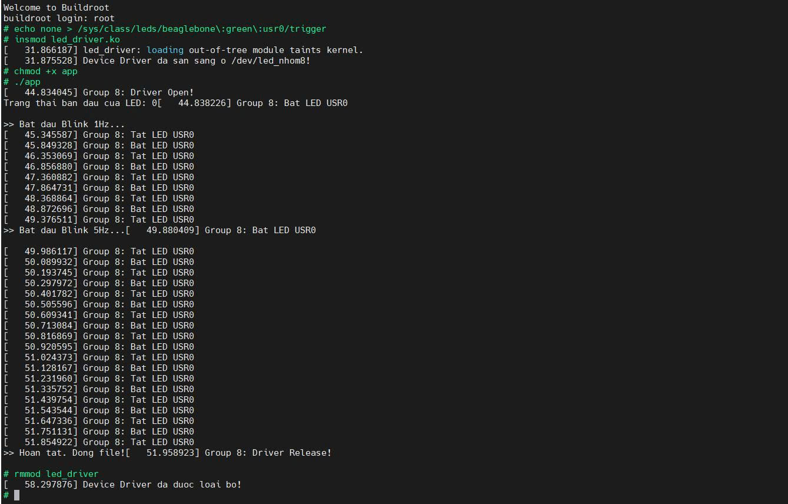

# TUẦN 7: Xây dựng Driver giao tiếp phần cứng cơ bản


## 1. Mục tiêu

* **Hoàn thiện 1 Driver có đủ các hàm cơ bản:** `my_driver_init`/`my_driver_exit`, `driver_open`/`driver_release`, `driver_read`/`driver_write` và đăng ký thông qua `static struct file_operations fops`.
* **Tự động cấp phát Major/Minor:** Cấp phát động thành công thông qua hàm `alloc_chrdev_region()`.
* **Tự động tạo file Device trong thư mục `/dev/`:** `class_create` và `device_create` để tự động sinh ra Device Node `/dev/led_nhom8`, sau đó liên kết qua `cdev_init` và `cdev_add`.
* **Đọc/Ghi dữ liệu giữa User và Kernel Space:** các hàm `copy_to_user` (trạng thái đèn LED lên màn hình) và `copy_from_user` (nhận lệnh bật/tắt từ ứng dụng).
* **Mở rộng Driver tương tác ngoại vi GPIO:** Sử dụng `ioremap` để ánh xạ bộ nhớ vật lý `0x4804C000`. Cấu hình thanh ghi `GPIO_OE` làm Output và cung cấp lệnh bật/tắt trực tiếp vào thanh ghi `GPIO_SETDATAOUT` / `GPIO_CLEARDATAOUT`.
* **Chương trình C ở lớp User Space:** Xây dựng file `app.c` điều khiển LED chớp nháy tự động ở các tần số khác nhau, nạp file `.ko` và file binary vào BBB và thực thi.

---

## 2. Quá trình thực hiện

```
// Tạo thư mục mới
mkdir -p ~/workspace/bt07
cd ~/workspace/bt07
```
### 2.1. Tạo File Driver (led_driver.c)
File bao gồm toàn bộ Device cơ bản và mở rộng điều khiển GPIO.
```
#include <linux/module.h>
#include <linux/fs.h>       // cấp phát Major/Minor và file_operations
#include <linux/device.h>   // class_create, device_create
#include <linux/cdev.h>     // cdev_init, cdev_add
#include <linux/uaccess.h>  // copy_to_user, copy_from_user
#include <linux/io.h>       // ioremap, writel, readl

#define DRIVER_NAME "led_nhom8"
#define CLASS_NAME  "led_class"

//  DIA CHI PHAN CUNG BBB
#define GPIO1_BASE        0x4804C000
#define GPIO1_SIZE        0x1000
#define GPIO_OE           0x134   // Thanh ghi cau hinh Input/Output
#define GPIO_DATAOUT      0x13C   // Thanh ghi doc trang thai Output
#define GPIO_CLEARDATAOUT 0x190   // Thanh ghi tat LED
#define GPIO_SETDATAOUT   0x194   // Thanh ghi bat LED
#define LED_PIN           21      // LED USR0

static dev_t dev_num;
static struct class *dev_class;
static struct cdev dev_cdev;

// Con tro luu dia chi ao sau khi ioremap
static void __iomem *gpio_base_addr; 

// CÁC HÀM CƠ BẢN (OPEN, RELEASE, READ, WRITE)
static int driver_open(struct inode *device_file, struct file *instance) {
    printk("Group 8: Driver Open!\n");
    return 0;
}

static int driver_release(struct inode *device_file, struct file *instance) {
    printk("Group 8: Driver Release!\n");
    return 0;
}

// Lenh doc trang thai LED và gửi lên User Space
static ssize_t driver_read(struct file *File, char *user_buffer, size_t count, loff_t *offs) {
    int not_copied;
    char val_str[2];
    uint32_t reg_val;

    if (*offs > 0) return 0;

    reg_val = readl(gpio_base_addr + GPIO_DATAOUT);
    if (reg_val & (1 << LED_PIN)) {
        val_str[0] = '1'; // LED dang sang
    } else {
        val_str[0] = '0'; // LED dang tat
    }
    val_str[1] = '\n';

    // Sử dụng hàm copy_to_user
    not_copied = copy_to_user(user_buffer, val_str, 2);
    if (not_copied == 0) {
        *offs += 2;
        return 2;
    }
    return -EFAULT;
}

// Lenh ghi trang thai LED từ User Space
static ssize_t driver_write(struct file *File, const char *user_buffer, size_t count, loff_t *offs) {
    int not_copied;
    char rec_buf[10] = {0};

    // Sử dụng hàm copy_from_user
    not_copied = copy_from_user(rec_buf, user_buffer, (count > 9) ? 9 : count);
    
    if (not_copied == 0) {
        if (rec_buf[0] == '1') {
            writel(1 << LED_PIN, gpio_base_addr + GPIO_SETDATAOUT); // Bat LED
            printk("Group 8: Bat LED USR0\n");
        } else if (rec_buf[0] == '0') {
            writel(1 << LED_PIN, gpio_base_addr + GPIO_CLEARDATAOUT); // Tat LED
            printk("Group 8: Tat LED USR0\n");
        }
        return count;
    }
    return -EFAULT;
}

// Đăng ký thông qua static struct file_operations
static struct file_operations fops = {
    .owner = THIS_MODULE,
    .open = driver_open,
    .release = driver_release,
    .read = driver_read,
    .write = driver_write
};

// INIT VÀ TẠO DEVICE FILE
static int __init my_driver_init(void) {
    uint32_t reg_val;

    // Tự động cấp phát Major/Minor
    alloc_chrdev_region(&dev_num, 0, 1, DRIVER_NAME);
    
    // Tự động tạo file Device trong thư mục /dev/
    dev_class = class_create(THIS_MODULE, CLASS_NAME);
    device_create(dev_class, NULL, dev_num, NULL, DRIVER_NAME);
    
    // Liên kết Device file với Major/Minor
    cdev_init(&dev_cdev, &fops);
    cdev_add(&dev_cdev, dev_num, 1);

    // Su dung ioremap de truy cap bo nho vat ly
    gpio_base_addr = ioremap(GPIO1_BASE, GPIO1_SIZE);
    if (!gpio_base_addr) {
        printk("Group 8: Loi ioremap!\n");
        return -1;
    }

    // Cau hinh chan LED Output
    reg_val = readl(gpio_base_addr + GPIO_OE);
    reg_val &= ~(1 << LED_PIN); // Clear bit 21 de set lam Output
    writel(reg_val, gpio_base_addr + GPIO_OE);

    printk("Device Driver da san sang o /dev/%s!\n", DRIVER_NAME);
    return 0;
}

static void __exit my_driver_exit(void) {
    // Tắt LED trước khi gỡ module
    writel(1 << LED_PIN, gpio_base_addr + GPIO_CLEARDATAOUT);
    
    // Giai phong ioremap
    iounmap(gpio_base_addr);

    cdev_del(&dev_cdev);
    device_destroy(dev_class, dev_num);
    class_destroy(dev_class);
    unregister_chrdev_region(dev_num, 1);
    
    printk("Device Driver da duoc loai bo!\n");
}

module_init(my_driver_init);
module_exit(my_driver_exit);

MODULE_LICENSE("GPL");
MODULE_AUTHOR("Nhom 8");
MODULE_DESCRIPTION("GPIO LED Driver BBB");
```

### 2.2. File chương trình User Space (app.c)
Tạo file app.c để thực thi thay đổi tần số Blink LED.
```
#include <stdio.h>
#include <stdlib.h>
#include <unistd.h>
#include <fcntl.h>
#include <string.h>

#define DEVICE_NODE "/dev/led_nhom8"

void blink_led(int fd, int times, int delay_us) {
    for (int i = 0; i < times; i++) {
        write(fd, "1", 1); // Bat LED
        usleep(delay_us);
        write(fd, "0", 1); // Tat LED
        usleep(delay_us);
    }
}

int main() {
    int fd;
    char read_buf[2] = {0};

    fd = open(DEVICE_NODE, O_RDWR);
    if (fd < 0) {
        printf("Loi! Khong the mo %s!\n", DEVICE_NODE);
        return -1;
    }

    // Doc trang thai ban dau
    read(fd, read_buf, 2);
    printf("Trang thai ban dau cua LED: %c\n", read_buf[0]);

    printf(">> Bat dau Blink 1Hz...\n");
    blink_led(fd, 5, 500000); // 500ms ON, 500ms OFF

    printf(">> Bat dau Blink 5Hz...\n");
    blink_led(fd, 10, 100000); // 100ms ON, 100ms OFF

    printf(">> Hoan thanh. Dong file!\n");
    close(fd);
    return 0;
}
```
### 2.3. Tạo Makefile
```
obj-m += led_driver.o

KDIR = $(HOME)/workspace/buildroot-2024.02.1/output/build/linux-custom
CROSS = $(HOME)/workspace/buildroot-2024.02.1/output/host/bin/arm-buildroot-linux-gnueabihf-

all:
	$(MAKE) -C $(KDIR) M=$(PWD) ARCH=arm CROSS_COMPILE=$(CROSS) modules

clean:
	$(MAKE) -C $(KDIR) M=$(PWD) ARCH=arm CROSS_COMPILE=$(CROSS) clean
```
## 2.4. Biên dịch file
```
// Bien dich Driver tao ra file led_driver.ko
make

// Bien dich ung dung tao ra file thuc thi app
~/workspace/buildroot-2024.02.1/output/host/bin/arm-buildroot-linux-gnueabihf-gcc app.c -o app
```
Sau đó sao chép 2 file đã biên dịch led_driver.ko và app vào BeagleBone Black

## 3. Quá trình thực thi
```
# 1. Tắt chế độ nháy mặc định của OS 
echo none > /sys/class/leds/beaglebone\:green\:usr0/trigger

# 2. Nap Device Driver vao Kernel
insmod led_driver.ko

# 3. Cấp quyền thực thi cho chương trình User Space
chmod +x app

# 4. Chạy chương trình điều khiển LED
./app

# 5. Gỡ Driver sau khi hoàn tất
rmmod led_driver
```
## Kết quả hiển thị:

