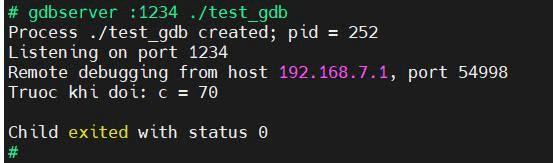
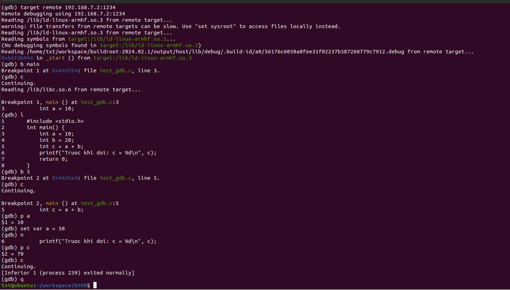
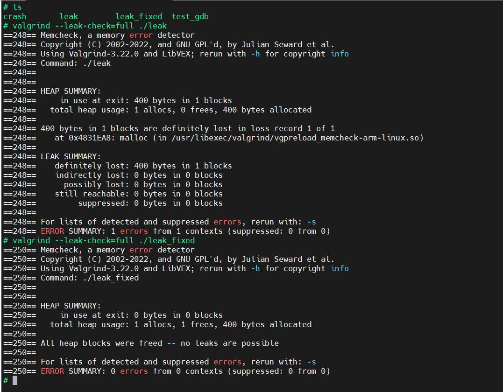
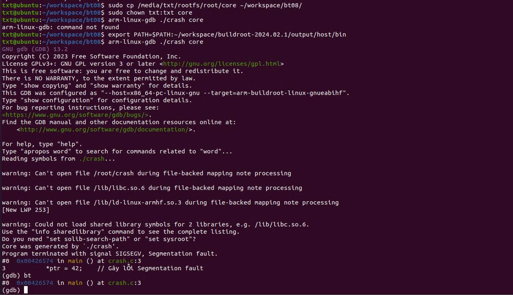
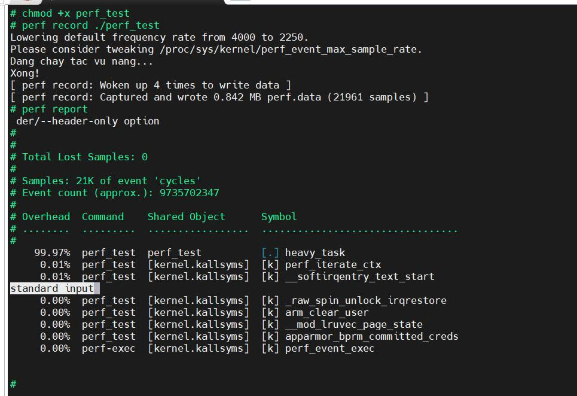
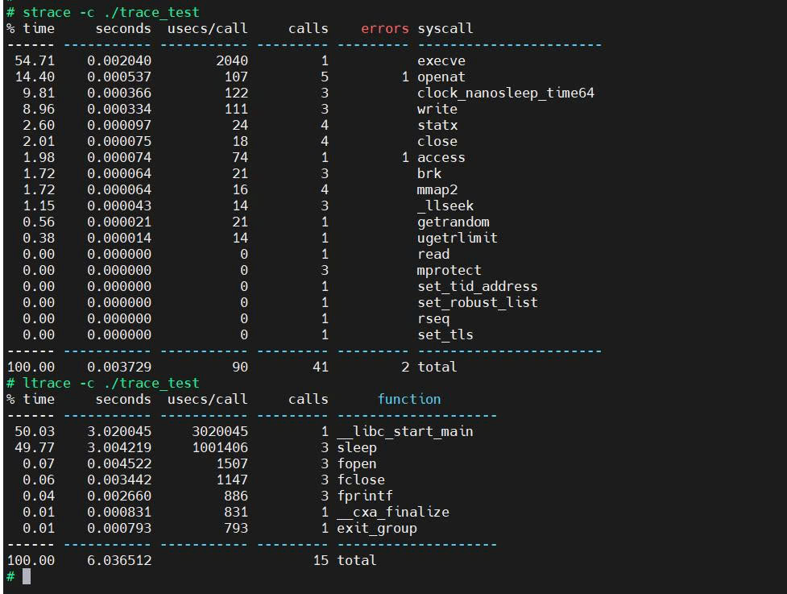

# TUẦN 8: Sử Dụng Các Công Cụ Debug Và Đánh Giá Hiệu Năng

[]()
[]()
[]()

## I. Mục tiêu 
Tổng hợp các kỹ thuật gỡ lỗi (debugging) và phân tích hiệu năng (profiling) ứng dụng C trên hệ thống Embedded Linux. Mã nguồn được biên dịch chéo trên máy Host và thực thi trên Target Board (BeagleBone Black).

---
## II. Quá trình thực hiện
### 1. Cấu hình Buildroot
Setup lại môi trường để hỗ trợ các công cụ gỡ lỗi:
```
cd ~/workspace/buildroot-2024.02.1
make menuconfig
```
Bật các tính năng:
* Vào Build options ---> build packages with debugging symbols
* Chọn cài đặt các package: gdb, valgrind, strace, ltrace, perf.

Sau đó iên dịch lại OS: `make`

### 2. Bài tập 2.1 & 2.2: Remote Debugging (GDB & GDBServer)
Thiết lập gỡ lỗi từ xa qua mạng LAN ảo (USB RNDIS) giữa máy Host và mạch BBB.
* Tạo chương trình test (test_gdb.c):
```
#include <stdio.h>
int main() {
    int a = 10, b = 20;
    int c = a + b;
    printf("Truoc khi doi: c = %d\n", c);
    return 0;
}
```
* Thực hiện biên dịch xong , sau đó copy file vào thẻ:
```
export PATH=$PATH:~/workspace/buildroot-2024.02.1/output/host/bin
arm-linux-gcc -g test_gdb.c -o test_gdb
```
* Thiết lập mạng và chạy GDBServer (Trên Target):
```
modprobe g_ether
ifconfig usb0 192.168.7.2 up
gdbserver :1234 ./test_gdb
```
* Kết nối GDB từ máy ảo Ubuntu (Host):
```
sudo ifconfig enx5ed070fa3ab9 192.168.7.1 up
arm-linux-gdb ./test_gdb
(gdb) target remote 192.168.7.2:1234
```
#### Kết quả đạt được: 

---


---

### 3. Bài tập 2.3: Phân tích bộ nhớ (Valgrind)
Sử dụng công cụ Valgrind để phát hiện rò rỉ bộ nhớ (Memory Leak) do không giải phóng con trỏ.

* File tạo lỗi (leak.c):
```
#include <stdlib.h>
int main() {
    int *ptr = (int*)malloc(100 * sizeof(int)); 
    ptr[0] = 99;
    // Lỗi: Quên lệnh free(ptr);
    return 0;
}
```
* Thực hiện kiểm tra trên Target:
```
valgrind --leak-check=full ./leak
```
(Sau đó tiến hành vá lỗi bằng cách thêm free(ptr); và chạy lại file leak_fixed để Valgrind trả về kết quả 0 bytes lost).
#### Kết quả thực hiện:

---
### 4. Bài tập 2.4: Phân tích Core Dump (Segmentation Fault)
Phát hiện lỗi ứng dụng sập do ghi dữ liệu vào vùng nhớ cấm (Null Pointer).

* Chương trình tạo lỗi (crash.c):
```
int main() {
    int *ptr = 0; // Con trỏ NULL
    *ptr = 42;    // Gây lỗi Segmentation fault
    return 0;
}
```
* Bật tính năng Core Dump và chạy file lỗi:
```
ulimit -c unlimited
./crash
# Màn hình sẽ báo lỗi: Segmentation fault (core dumped)
ls -lh 
# Xác nhận có file "core" đã được tạo ra
```
* Phân tích nguyên nhân bằng GDB (Đưa thẻ nhớ về Host):
```
sudo cp /media/txt/rootfs/root/core ~/workspace/bt08/
sudo chown txt:txt core
arm-linux-gdb ./crash core
(gdb) bt
# Kết quả trỏ chính xác về dòng code *ptr = 42
```
#### Kết quả thực hiện:

---
### 5. Bài tập 2.5: Phân tích hiệu năng (Perf)
Xem thời gian chiếm dụng CPU của các hàm trong chương trình.

* Chương trình tốn tài nguyên CPU (perf_test.c):
```
#include <stdio.h>
void heavy_task() {
    long long sum = 0;
    for(long long i = 0; i < 500000000; i++) { // Vong lap ton CPU
        sum += i;
    }
}
int main() {
    printf("Dang chay tac vu nang...\n");
    heavy_task();
    printf("Xong!\n");
    return 0;
}
```
Kiểm tra trên Target:
```
perf record ./perf_test
perf report
```
#### Kết quả thực hiện:

---
### 6. Bài tập 2.6: Phân tích Tracing
Giám sát các lời gọi hệ thống (System Calls) và quá trình tương tác với thư viện chia sẻ (Shared Library).

* Chương trình tương tác hệ thống (trace_test.c):
```
#include <stdio.h>
#include <string.h>
#include <unistd.h>

int main() {
    int count = 0;
    while(count < 3) {
        FILE *f = fopen("log.txt", "a"); 
        if (f) {
            fprintf(f, "Step %d: Hello Buildroot\n", count);
            fclose(f);
        }
        strlen("Check shared lib"); // Gọi shared library
        sleep(1); // System call tạo delay
        count++;
    }
    return 0;
}
```
Thực hiện giám sát: `strace -c ./trace_test`
(Bảng tổng hợp hiển thị thời gian và số lần gọi các syscall như openat, write, close, nanosleep...)
#### Kết quả thực hiện:

